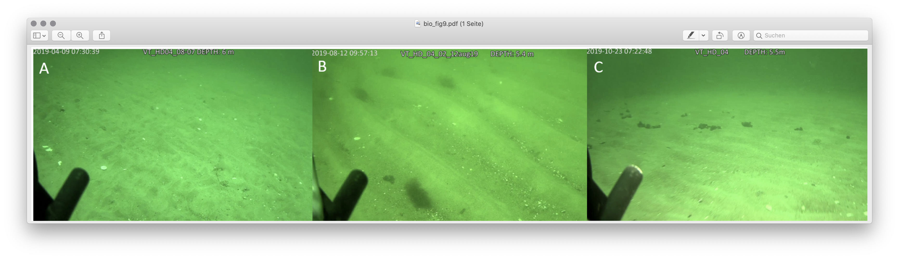
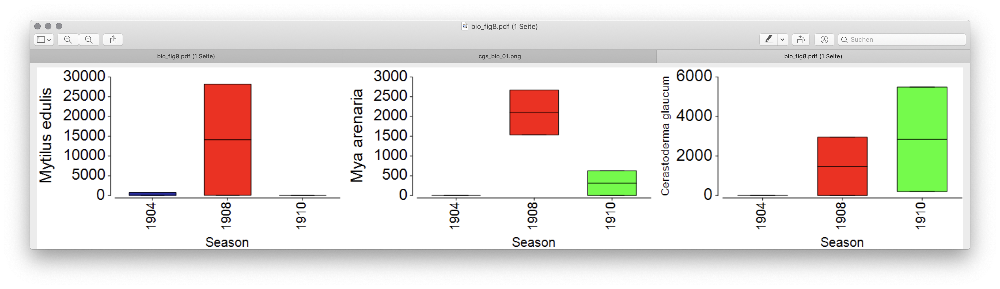

# Seagrass meadows
Seagrass meadows are one of the most important habitats on the globe. In the Western Baltic Sea
the seagrass Zostera marina is reported all over the place near the coast. Its occurence has considerably decreased 
from 17m water depth to only 8-9m water depth today. Eutriphication, algae growth, and thus light limitations is expected the main reasons. 

## Zostera marina 

## Location

The sample area is from Flensborg to Kiel / Heidkate covering water depths around 5-8m

## Physicochemical behavior and geoacoustic setting
Zostera marina min. water depth: 1.5m
Zostera marina max. water depth: 8m
Zostera marina substrate: sand, silt
Zostera marina sediment penetration: 0.3m
Zostera marina canopy height: 1m
Zostera marina diameter leaf: 1-6mm
Zostera marina color: green
Zostera marina season: perannual, predominantly in months 5-11

Can be overgrown with red algae
Does not like freshwater
Shoots rise in June
Can settle on sand and silt of very little thickness
Some leaves can remain throughout the year

## Ground Truthing Data
### Geology
Video Transects performed by LLUR (Submaris), visual detections e.g. seagrass on bright sand, stones, overgrown stones. 

### Biology
Video Transects performed by LLUR (Submaris), visual detections e.g. seagrass on bright sand, stones, overgrown stones.

*Images taken during our cruise with RV Littorina June 2019*

## Remote Sensing Data

### Spaceborne
Analyses of time-lapse spaceborne images taken in our Study site showed that the visibility through water of the Baltic Sea turned out to be better than expected. Though, we found it to be extremely variable depending on the weather and wind situation some days before the spaceborn picture was taken. E.g. by visual inspection sand bars could be clearly disciminated against areas populated with submerged aquastic vegetation until a water depth of 5m. If groundtruth data is available the dark patches can be mapped to seagrass meadows. A pure spectral discrimination of the seagrass Zostera marina is critical, at least when considering the spectral bands of Sentinel. Nontheless, some meaningful indices from multispectral considerations may be applicable to improve spaceborn mapping from space. How reliable such optical determination of Zostera marina performs on darker substrate with higher mud content remains to be evaluated. 
With ever increasing improvments in spatial and spectral resolutions resolution modern satellites provide 

### Airborne

### Vessel-born acoustic 
As an exception to the guideline that low frequencies have a higher sensitivity to soft-sediments habitats where at least some volume scatter is present, the coarse-grained features are more clearly observed in high-frequency backscatter mosaics of 550 kHz and 700 kHz (with grain size approaching or exceeding the acoustic wavelength; e.g. station HD12, Table \ref{tab:geolsamples}). In the multispectral map (Figure \ref{fig:HD_freq_comp}), this can be utilized to quickly spot the ecologically valuable areas of coarse sand and gravel (CSG) by their bluish tint. 

*Detail of the multifrequency image of a CSG facies, with two example underwater snapshots for finer sand and coarser gravel areas, respectively. Note the blue appearance of the coarse gravel material in the acoustic data, representing a relatively higher sensitivity to high frequencies.*

## Seasonality

*Seasonal changes in the biomass [FM mg/m$^2$]of selected benthic macrofauna species at stations attributed to CSG habitat. Different colours correspond to different seasons*

*Visualisation of differences between Spring and Summer in the Hohe Düne focus area in 2019. The mosaics comprise only two channels (200 kHz, red channel, and 400 kHz, green channel). Note the different appearance of seagrass of different abundance in the backscatter mosaics (medium row), and the appearance of hydrodynamically induced bedforms in facies D (lowermost row).*

## Repeatable Description of Processing Steps

## Example Data

## References

---

---
