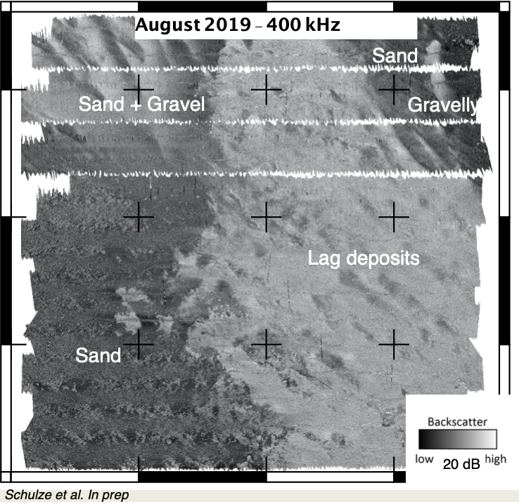

# Shallow occurence of coarse sand and gravel


## Location

The sample reef area HOHE DÜNE is located in water depths of approx. 5 m in the southern baltic Sea directly offshore Rostock-Warnemünde.

## Ground Truthing Data
### Geology
In the sample area, two habitats of high and low backscatter intensity, respectively. A relation of camera data, grab samples and backscatter information shows that darker colours of lower backscatter intensity intensity are composed of fine to medium sand, while an increasing amount of coarse sand and gravel and extended ripple fields are observed in the areas of higher backscatter intensity. In bathymetric data, the coarser-grained seafloor is located slightly below the finer grained material, pointing to a hydrodynamic origin of fine sediments covering a coarser substratum. 



### Biology
The similarity of community structure of two stations considered to be concisely located within the area of coarse sand and gravel (CSG habitat) is relatively low (see figures below). The community displays lowest total biomass, total abundance and specie richness comapred to the other habitats in the study site. The biomass at station HD13 in April and August was dominated by blue mussels (_M. edulis_), but the species was completely absent in October samples. The second species in terms of biomass dominance was _P. ulvae_. Characteristic taxa revealed for this habitat by Indicator Value analysis based on biomass were polychaetes _Capitella capitate_, _Hediste diversicolor_, and _Paraonis fulgens_. Individuals of an oligochaete family Enchytraeidae were also found at both stations, however only once over three sampling events; in August with abundance of 1150 ind/m^2 and biomass of 36 mg/m^2, and in October, with 25 ind/m^2 and only 7 mg/m^2. Overall abundance was dominated by _P. ulvae_ with a minimum of 100 ind/m^2 in spring and a maximum of 7325 ind/m^2 in autumn (when the contribution of taxa exceeded 95% of relative abundance at both station). Traces of _A. marina_ were also observed with underwater imaging in this zone, though density was lower comparing to seagrass habitats (see example in ATLAS folder of this git), and the shape of coiled castings was less pronounced due to sediment properties. 


*Images from coarse sand and gravel habitat location 40 m north-east from station HD13 recorded in April (A), August (B) and October 2019 (C) showing typical ripple structure, shell debris, low density of lugworm traces, and lack of vegetation and epifauna apart from sporadic drifting algae (ephemeral filamentous algae) and blue mussels.*


_Seasonal changes in the biomass [FM mg/m2]of selected benthic macrofauna species atstations attributed to CSG habitat.  Different colours correspond to different seasons._

## Remarks to acoustic data

In multifrequenca backscatter mosaics, areas of increased gravel content are characterized by their bluish colors, caused by relatively increased backscatter at higher frequencies. As an exception to the general guideline that low frequencies have a higher sensitivity to soft-sediments habitats when at least some volume scatter is present, the coarse-grained features are more clearly observed in high-frequency backscatter mosaics of 550 kHz and 700 kHz (with grain size approaching or exceeding the acoustic wavelength). In the multispectral map (an example displayed below), this can be utilized to quickly spot the ecologically valuable areas of coarse sand and gravel (CSG) by their bluish tint. 


*Detail of the multifrequency image of a CSG facies, with two example underwater snapshots for finer sand and coarser gravel areas, respectively. Note the blue appearance of the coarse gravel material in the acoustic data, representing a relatively higher sensitivity to high frequencies.*

## Seasonality
The biomass of _P. ulvae_ and _C. glaucum_ increased from spring to autumn, though the pattern for  the  latter  species  was  not  consistent  between  stations.   At  both  stations  the  biomass  of _M.arenaria_ was high in summer, but was species was absent or contributed only little in other seasons.   The  seasonal  data  demonstrate  the  impact  of  hydrodynamic  forcing  on  this  facies, with additional dune-features occurring in October compared to earlier surveys.  The multifrequency data shows that the sediment dynamic also changed thesediment composition of the seafloor, with an increasing amount of coarse sand and gravel exposedby movement of the finer material situated above.


*Seasonal changes in the biomass [FM mg/m$^2$]of selected benthic macrofauna species at stations attributed to the coarse sand andgravel habitat. Different colours correspond to different seasons*


*Visualisation of differences between Spring and Summer in the Hohe Düne focus area in 2019. The mosaics comprise only two channels (200 kHz, red channel, and 400 kHz, green channel). Note the different appearance of seagrass of different abundance in the backscatter mosaics (medium row), and the appearance of hydrodynamically induced bedforms in facies D (lowermost row).*

## Repeatable Description of Processing Steps
The following processing steps for the acoustic data utilize MB-System (https://github.com/dwcaress/MB-System) and the Pysesa Toolbox by Daniel Buscombe (https://dbuscombe-usgs.github.io/pysesa/README.html) and a Python environment (e.g., https://www.anaconda.com), GDAL (https://gdal.org) and GMT (https://www.generic-mapping-tools.org). For reproducing the data, please download the following dataset (approx. 60 GB), including a summer-survey with two frequencies of 400 and 700 kHz, from https://www.dropbox.com/sh/80omr76fyo1b1i4/AACEAKTIOkOy-ctEXi8mwCnHa?dl=0. A virtual machine with mbsystem is available at https://www.dropbox.com/s/zv67hq1jqwzaoxc/summerschool_v2.ova?dl=0 and can be loaded in VirtualBox, however as of today (28.10.2020), the installed mbsystem in the virtual machine is outdated and needs to be updated. 

### Reproduce the multispectral grids
The following steps can be reproduced to repeat the backscatter maps (NOTE: we leave out steps for roll calibration, cleaning of data and sound velocity corrections which affect quality of the bahtymetric data. In the tutorial section of this git, information on how to apply these corrections is available).
We use the tool PROCESSING_MBSYSTEM.py , which is found in this git under Code/MBES_Processing. To create a mosaic of the 400 kHz data, edit the file mbsystem_config.py to have thefollowing values:

```
##############################################################
# LEVEL 1: IMPORT AND BASIC CORRECTIONS
##############################################################
# Control which levels are worked on
LEVEL1 = 'yes'
LEVEL2 = 'yes'
LEVEL3 = 'yes'

remove_lock_files = 'yes' 
PFAD = './../../ATLAS/data/400/'   # end with / . CHange if you stored data elswhere
rekursive_directory_search = 'no'
PREPROCESS = 'yes'
FORMAT = 89  # for s7k files
file_end = '.s7k'
SS_FORMAT = 'C'  # C to read field 7058 in s7k. S to read field 7028 
AREA = '12.1053/12.11422/54.1844/55.189965'
GENERATE_DATALIST = 'yes'
AUTO_CLEAN_BATHY = 'yes'
ATTITUDE_LAG = ''
SELECT_SVP = '' 
SVP = ''           
CORRECT_HPR=''
ROLL_CORR = 0.00
PITCH_CORR = 0.00
CORRECT_TIDE = ''    
TIDEFILE = '' 
CORRECT_DRAFT = 'yes'
DRAFT_CORR = 0.4
EXPORT_NAV = 'no'       

##############################################################
# LEVEL 2: Correct Backscatter Data
##############################################################
EXPORT_ARC_CURVES = 'no'
PROCESS_SCATTER = 'yes'  
CONSIDER_SEAFLOOR_SLOPE = ''
AVERAGE_ANGLE_CORR = 'yes' 

SSS_ACROSS_CUT = 'yes'
SSS_ACROSS_CUT_MIN = -20
SSS_ACROSS_CUT_MAX = 20

SSS_CORRECTIONS = 'yes' 
SSSWATHWIDTH = 160  
SSINTERPOLATE = 2

##############################################################
# LEVEL 3: Make grid data
##############################################################
SCATTER_FILTER = 'low'      
INTERPOLATION = '-C3/1'   

## Grids
WORK_ON_PER_FILE_BASIS = 'no'  

# Work for both on a per-survey and per file setting
GENERATE_BATHY_GRIDS = 'yes'
GENERATE_SCATTER_GRIDS = 'yes'
SCATTER_WITH_FILTER ='yes'   #Export filtered grids
EXPORT_XYI_FROM_GRID = 'no'
BATHY_RES = '-E1/1'
SCATTER_RES = '-E0.25/0.25'

# convert Grids
UTM_Convert = 'no'
ZONE = '-JU'   

#Only for work on a per-file bases
EXPORT_BEAM_ANGLE = 'no'    
EXPORT_XYI = 'no'           
EXPORT_XYZ = 'no'
KFAKTOR = 50               

FORCE_MBPROCESS = 'no'   
number_of_exceptions = 0

```

Then, execute the file 
`python PROCESSING_MBSYSTEM.py`

which will generate a sss_grid_filtered.grd file in the 400 kHz folder. Repeat the steps for the 700 kHz folder by adapting the path correspondingly.

To combine the two grids into a multispectral tif, convert the two grid files to grayscale georeferenced tif images and copy the results in one common folder. 

`gmt grdimage sss_grid_filtered.grd -A400.tif -Cgray`
`gmt grdimage sss_grid_filtered.grd -A700.tif -Cgray`

These two images can now be combined to a multispectral image using gdal. 

```
gdalbuildvrt -separate RG.vrt A400.tif A700.tif
gdal_translate RGB.vrt RG.tif
```

The resulting file can be  loaded into QGIS and should look similar to this:

## References

---


---