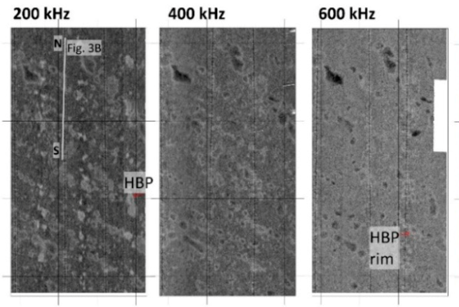
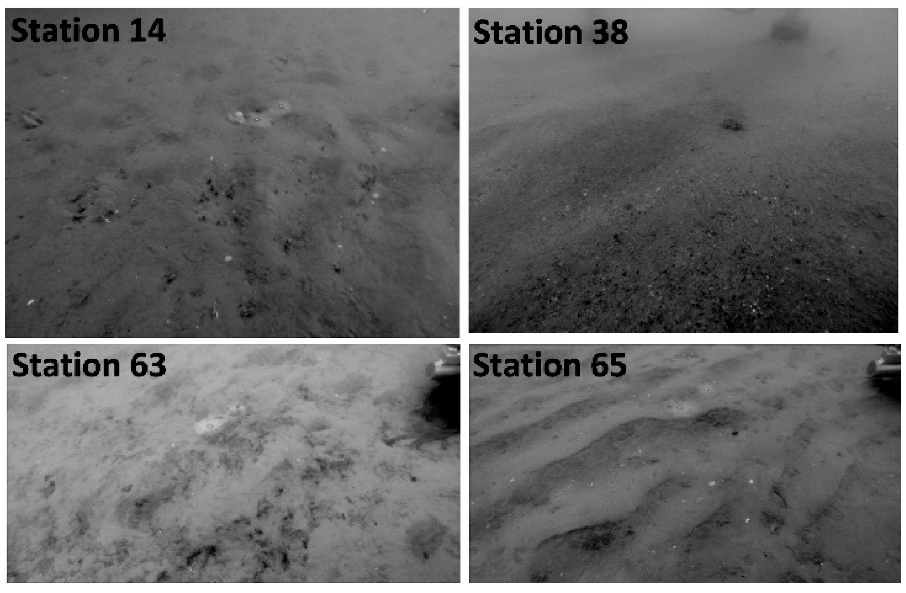

# Sparse Lanice conchilega beds in the North Sea
For more details than given here and additional references, refer to Feldens et al. (2018), Improved Interpretation of Marine Sedimentary Environments Using Multi-Frequency Multibeam Backscatter Data, Geosciences 8(6)

## Location

The study site is located approx 15 km offshore the island Sylt (Figure 1) in the German Bight 2in water depths of 15–18 m, covering an area of 8 km . In the area, glacial sediments of the Saalian period were covered by Weichselian periglacial and Holocene fluvial deposits (Diesing et al 2006). These deposits were reworked during the Holocene sea level rise, leaving a low relief seafloor topography mainly composed of marine sand (Zeiler et al. 2000). The thickness of the uppermost layer of mobile sand deposits (potentially moved by tides and storm events) reaches 1–3 m (Zeiler et al 2000). Locally, east–west directed sorted bedforms (rippled scour depressions) composed of medium to coarse sand are observed, often exposing a transgressive layer of gravel and coarse sand present at the base of the marine sands. Reefs of the polychaete Lanice conchilega are widespread in the study site but show a high seasonal and annual change in population density (Heinrich et al 2016). The tubes of L. conchilega, formed by cemented sediment grains and shell fragments, have a diameter of up to 0.5 cm, and protrude 1–4 cm above the seafloor by (Ziegelmeyer et al. 1952). Aggregating in patches, these reefs can have high densities of thousands of individuals per m2 and reach elevations of up to 20 cm (Rabaut et al. 2009).

## Acoustic data
Here, an example of low-density Lanice population is presented. ***For their acoustic appearance at higher densities, refer to Heinrich et al (2016).*** Unfortunately, this publication is not open access and we cannot repeat it here. 

For areas with sparse _L. conchilega_ , numerous patches of increased backscatter levels (high backscatter patches, HBPs) are visually delineated. HBPs cannot be observed in bathymetric data, suggesting that the depth difference between the patches and the surrounding seafloor is less than 5 cm. HBPs have an irregular to partly elongated shape and a random distribution pattern. Their diameter is 10–25 m. In the 200 kHz mosaics, the HBPs show increased (~2 to 4 dB) backscatter intensities compared to the background sediment. The increase in intensities is reduced in the 400 kHz data (~2 dB) and hardly observed in the 600 kHz data. This results in a distinct reddish appearance of the HBP in the multi-frequency data. In several instances, backscatter strengths of the _L. conchilega_ patches decrease in the high-frequency data compared to the surroundins, causing an inverse behavior between the 200 kHz and the 600 kHz data. 

An increase of the silt fraction percentage is observed for sample HE486-14 retrieved from an area of densely spaced HBPs, and a poorly developed ripple pattern is recognized in nearby underwater video footage. An increased number of polychaetes identified as L. conchilega were observed in grab samples and underwater video images in the northern part of the investigation area, although overall observed population densities are low.

 
_Mosaics of 200, 400 and 600 kHz for selected areas. Examples of high backscatter patches (HBP) related to sparse L. conchilega patches are marked._

 _Underwater video footage from the northern study site (station 14) shows small numbers of L. conchilega tubeworms. In contrast, station 38 at the boundary of a sorted bedform comprises rippled coarse sand. In the south, station 63 shows different benthic assemblages in the center of a high backscatter patch. Outside of the patch, a clear ripple pattern prevails (station 65). Refer to Figure 2 for positions._

## Seasonality
Lanice conchilega beds can show a massive interannual change over several sqaure kilometres. Again, the corresponding publication Heinrich et al. (2016) is unfortunately not free available. 

## Repeatable Description of Processing Steps
A Norbit iWBMSe multibeam echosounder mounted on the moonpool of FS Heincke was used together with an Applanix SurfMaster inertial navigation and attitude system. For the three surveys (recorded 13–16 May 2017), frequencies were set to 200, 400 and 600 kHz. EGNOS correction data were received to improve navigation to 0.5 m lateral accuracy. We registered backscatter strength using the Hypack 2016 software. Processing focused on removing the angular variations present in the data by applying an angular varied gain (AVG) and comparing relative backscatter levels between the frequencies. No absolute dB values are given.
Except for frequency, the user-controllable settings of the multibeam system were kept constant and are shown in Table 1. System gains are largely removed from the multibeam output by the Norbit software (level BL1). Residual effects may still be observed because the instruments are not individually calibrated. Pulse lengths and frequencies are constant throughout the swath with no sector dependence. Backscatter data were loaded in QPS Geocoder and corrected considering survey settings and frequency-dependent absorption. For calculation of absorption coefficients, the temperature was estimated as 11° with salinity to 35. AVG to flatten the backscatter mosaics was calculated using a flat seafloor assumption, given that morphological differences across the study site are minor. AVGs were averaged for complete survey lines to avoid artifacts across boundaries of changing backscatter, accepting a less ideal removal of along-track artifacts. The average seafloor response within an incidence angle interval of 30° to 60° was used to normalize the data. Beam pattern effects were removed by applying the AVG. Backscatter intensities were linearly mapped to a greyscale mosaic with a resolution of 0.3 m. The dynamic range of the mosaics is 10 dB. Dark colors represent low backscatter intensities and bright colors represent high backscatter intensities. The final mosaics were filtered using a 3 × 3 box average filter. Multi-frequency mosaics were created by using three mono-frequency greyscale mosaics as input channels of an RGB image using open source GIS software (QGIS 2.18.9, www.qgis.org). The 200 kHz frequency represents the red channel, the 400 kHz frequency the green channel, and the 600 kHz frequency the blue channel. Angular response curves (ARCs) supporting the mosaic interpretation were calculated directly from the recorded raw data files. The angular backscatter strength is:

BS(θ)=EL(θ)−SL+2TL−10log(A(θ))

where BS is the angular backscatter strength, θ is the incidence angle, EL is the recorded echo level, SL is the (estimated) source level, TL is the transmission loss (spreading + absorption) and A is the ensonified area. The calculation of the texture parameter entropy [45] supporting the mosaic interpretation was done using 32 grey levels, an inter-pixel distance of 1 and a window size of 4.5 m [46].

## References
Diesing, M.; Kubicki, A.; Winter, C.; Schwarzer, K. Decadal scale stability of sorted bedforms, German Bight, southeastern North Sea. Cont. Shelf Res. 2006, 26, 902–916.

Heinrich, C.; Feldens, P.; Schwarzer, K. Highly dynamic biological seabed alterations revealed by side scan sonar tracking of Lanice conchilega beds offshore the island of Sylt (German Bight). Geo-Mar. Lett. 2017, 37, 289–303. 

Rabaut, M.; Vincx, M.; Degraer, S. Do Lanice conchilega (sandmason) aggregations classify as reefs?
Quantifying habitat modifying effects. Helgol. Mar. Res. 2009, 63, 37–46. 

Zeiler, M.; Schulz-Ohlberg, J.; Figge, K. Mobile sand deposits and shoreface sediment dynamics in the inner German Bight (North Sea). Mar. Geol. 2000, 170, 363–380. 

Ziegelmeier, E. Beobachtungen über den Röhrenbau von Lanice conchilega (Pallas) im Experiment und am
natürlichen Standort. Helgolander Wiss. Meeresunters 1952, 4, 107–129.

---

---