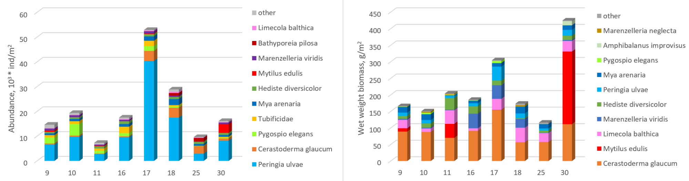
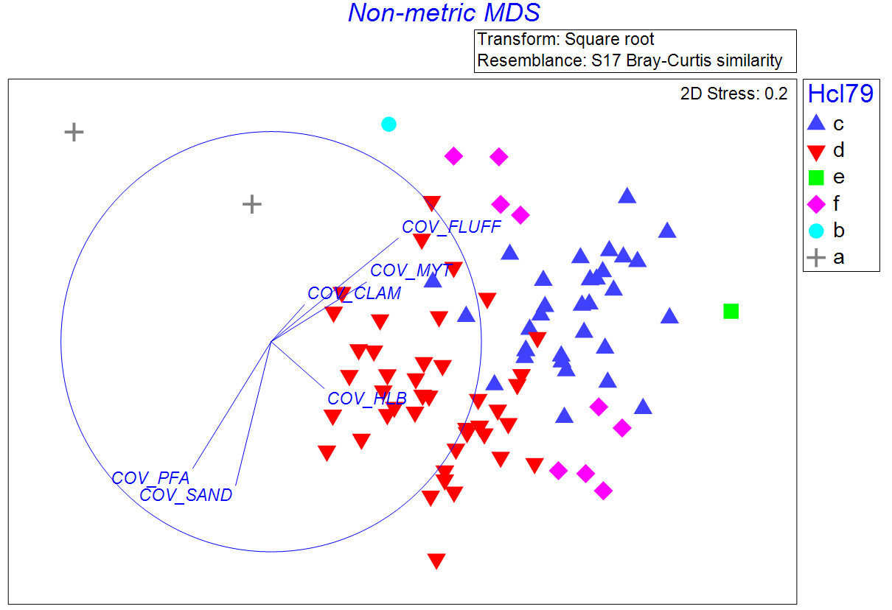
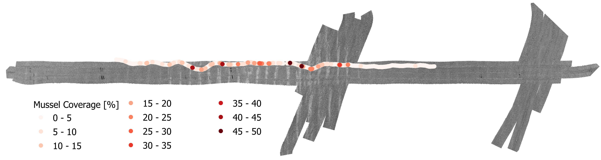

# Mussel bank on fine sand

## Location

The examplary mussel banks on fine sand occur in the Pomeranian Bay/Southern Baltic Sea, southwest to the prominent morphological feature of the Oder Bank. The area is relatively flat, with water depth around 14 to 16 m.

## Ground Truthing Data
### Geology
Results from HAPS cores at 4 sampling stations (EMB205-10, 11, 16, 17) show a homogeneous grain size distribution, in the range of fine to medium sand. No lateral variations appear, but vertically, an increased amount of shell fragments occurs in depth greater than 8 cm, especially at stations EMB205-10. Generally, the seafloor surface is characterized by small sand ripples and very similar at all sampling stations.

### Biology
Macrofaunal assemblage structures is often explored in terms of the species richness, abundance, biomass and diversity. To integrate functionality, bioturbation potential of macrofaunal assemblages can also be considered (as bioturbation has significant implication on the biogeochemical fluxes of marine sediments). Presence of benthic organisms and bioturbation can also cause changes in natural interface roughness, in turn, next to sediment composition and hydrodynamic forces, having impact on backscatter data (Schönke et al., 2019; Briggs et al., 2001).

*Abundance and biomass of dominant species at each sampling site. Species contributing to over 96% of total abundance and 98% of total wet weight biomass are shown.*

A towed video sledge was used for ground-truthing. It is equipped with a downward-looking camera system to record high-resolution photos and videos (Beisiegel et al., 2018). The seafloor imaging analysis software CPCe was used on 90 selected images to estimate the coverage statistics resolved to different substrate, identified taxa or morphotype.
Based on the coverage data, a Hierarchical Cluster and Non-metric Multi-Dimensional Scaling analysis allow the grouping of the UW photos.

*Ordination of Bray-Curtis similarities in coverage data.*

*Exemplary UW photos of two major groups (resulting from Hierarchical Cluster and Non-metric Multi-Dimensional Scaling analysis based on coverage data; significance of differences between groups in confirmed by ANOSIM).*

Group c is characterised by relatively high coverage by unattached mussel clusters. Several other groups show small differences, e.g., a very low coverage (<4%) of *Hartlaubella* (Group f), or an increased coverage by fluffy layer, but all have a high coverage by unattached mussel clusters in common, which allows for a combiniation.
Sand was observed in images of Group d with average coverage over 60 %, indicating infauna-dominated habitat.

According to HUB (HELCOM Undewater biotope and habitat classification system) classification of Benthic habitats at Level 3, the entire area is “coarse sediment and sand”, and most of it is classified as AB-J3L9 Baltic aphotic sand dominated by multiple infaunal bivalve species (Schiele et al., 2015). 

## Acoustic/Optical Data

Parallel stripes of high-backscatter strength appear in the central part of the investigation area with a very regular spacing of ~50 m. The stripes are oriented in NW-SE direction. The increase of backscatter intensity to the surrounding seafloor is similar in all four considered frequencies (200, 400, 550, and 700 kHz).

 To determine the percentage of mussel covered areas in a higher resolution (one image per second), a channel of each image was clustered, and after the application of dilation and erosion algorithms, a color intensity threshold divides the images' pixels in mussel and sand.

*Backscatter mosaic for 400 kHz frequency (range: -30/-40 dB). Prominent stripes of high-backscatter strenth appear in the center, which spatially coincide with increases in mussel coverage.* 

## Repeatable Description of Processing Steps

Refer to the file "Coarse sand and gravel.md", where the processing steps of the acoustic data are given.

## References

Beisiegel, K., Darr, A., Zettler, M. L., Friedland, R., Gräwe, U., & Gogina, M. (2018). Understanding the spatial distribution of subtidal reef assemblages in the southern Baltic Sea using towed camera platform imagery. Estuarine, Coastal and Shelf Science, 207, 82-92.

Briggs, K.B.; Williams, K.L.; Richardson, M.D.; Jackson, D.R. E_ects of Changing Roughness on Acoustic Scattering: (1) Natural Changes. Proc. Inst. Acoust. 2001, 23, 343–390.

Schiele, K. S., Darr, A., Zettler, M. L., Friedland, R., Tauber, F., von Weber, M., & Voss, J. (2015). Biotope map of the german baltic sea. Marine Pollution Bulletin, 96(1-2), 127-135.

Schönke M, Wiesenberg L, Schulze I, Wilken D, Darr A, Papenmeier S, Feldens P, 2019. Impact of Sparse Benthic Life on Seafloor Roughness and High-Frequency Acoustic Scatter. Geosciences 2019, 9, 454; doi:10.3390/geosciences9100454

Tauber, F. Meeresbodensedimente in der deutschen Ostsee= Seabed sediments in the German Baltic Sea. BSH, Bundesamt für Seeschifffahrt und Hydrographie 2012.

---

