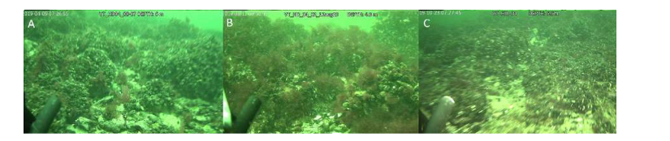
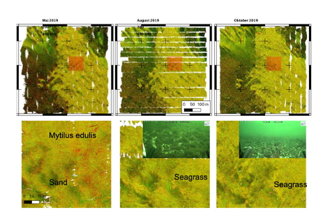
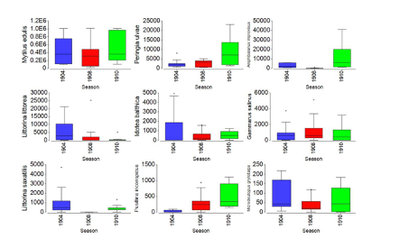

# Shallow occurence of coarse sand and gravel

## Location

The sample CGS area HOHE DÜNE is located in water depths of approx. 5 m in the southern baltic Sea directly offshore Rostock-Warnemünde.

## Ground Truthing Data
### Geology
In the sample area, two habitats of high and low backscatter intensity, respectively. A relation of camera data, grab samples and backscatter information shows that darker colours of lower backscatter intensity intensity are composed of fine to medium sand, while an increasing amount of lag deposits, coarse sand and gravel and extended ripple fields are observed in the areas of higher backscatter intensity. The reef considered in this example is recognized by the high backscatter lag deposits displayed in bright colours in the below backscatter image. The reef area is composed of overall sandy sediments and the frequent occurence of stones in underwaver video images. On the reef, stripes and patches of low-backscatter strength oriented in NW-SE direction appear irregularly. They appear similarly in all frequencies. Within these low-intensity stripes, the combined multifrequency images demonstrate a slight relative increase of high frequency scatter not visible in the monofrequent images, resulting in a bluish color tint. In addition, patchy spots (few meter in diameter) with increased low-frequency backscatter intensities are observed. Outside of the stripes, no clear dominance of one frequency is found, with changes in dominant frequency controlled by background noise. 

### Biology ground truthing related to acoustic data
The biological ground tuthing in general agreed to the classes dervied from the multispectral mosaic (Figure below). Ground truthing reveals that the majority of the reef is covered by mussel bank of _Mytilus edulis_ of variable density. In the reef area community biomass is heavily dominated by _Mytilus edulis_ (with share in total biomass ranging from 80 to 99\%). Rocks and boulders as well as attached benthic vegetation here provides a 3 dimensional habitat and feeding environment for epifauna. Species richness was highest compared to other habitats in the Hohe Düne area and increases towards autumn. Decreasing densities of _Mytilus edulis_, corresponding to patches of visible sand, appear at slightly lower backscatter intensities. Camera profiles show that at the transition from the high-backscatter reef to the low backscatter stripes mussels disappear and rippled sand is observed. The observed increase in high-frequency backscatter strength presumably relates to a coarser sediment composition that is can be observed in the ripple troughs in video data. This is interesting to note, as it is known that _Mytilus edulis_ avoids regions of coarser sediment. Small patches sensitive to lower frequencies, displaying reddish colours, were found to relate to seagrass occurrence. 

_Images from reef habitat location 60 m west from station HD15 recorded in April (A), August (B) and October 2019 (C) showing with different growth stages of Delesseria sanguinea._

_Spatial distribution of sampling locations (right column) visited in April (top, Dual frequency backscatter), August(center, triple-frequency backscatter)  and  October  2019  (bottom, triple-frequency backscatter).   The  corresponding  dendrograms  resulting  fromhierarchical  cluster  analysis  using  the  Bray–Curtis  similarity  index  calculated  on  log-transformed wet weight biomass (left column).  Colors of symbols correspond to habitatassumed based on multifrequency acoustic mosaic. For the dual-frequency backscatter mosaics, the red channel represents 200 kHz and the green channel 400 kHz. For the mosaic composed of three frequences, red channel represents 200 kHz, the green channel 400 kHz and the blue channel 700 kHz. Note the occurence of bluish patches on the reef platform, corresponding to a coarser sediment composition._

## Seasonality
Acoustic data shows a change in boundaries of the sand patches (although their large-scale pattern remains approximately stable through the observed annual cycle). Whether this is related to changes in _Mytilus edulis_ coverage or hydrodynamic impact on seafloor sedimentology is not yet clarified at the time of writing this entry. Though both total biomass and biomass of blue mussels were slightly higher in autumn, according to Kruskal-Wallis test these changes were not significant. Surprisingly, the biomass of _Amphibalanus improvisus_ nearly disappeared in summer (see figure below), but showed significant increase in autumn comparing to spring values. _A. improvisus_ is commonly attached to various bivalve hosts shells, including blue mussels, as well as dead molluscs, and is known to tolerate strong water flow, large range of salinity and high levels of pollution. Thus such an abrupt drop in biomass can possibly be explained by predation. Apart from benthofagous fish, _Asterias rubens_ and the crab _Carcinus maenas_ both prey upon blue mussels and its associated epibionts. Two gastropod molluscs _P. ulvae_ and much less abundant _Pusillina inconspicua_ indicate increasing biomass, whereas the biomass of two Littorina species showed highest values in spring. A prominent change in video data is the occurrence of the pseudo-seasonal red algae _Polysiphona fucoides_ during summer. It is not possible to differentiate the occurrence of the red algae using backscatter mosaics, though promising indications that their presence has a noticeable impact on scatter above the bottom detection point as recorded in snippet data are currently analyzed. 

_Visualisation of differences between Spring and Summer in the reef. The mosaics comprise only two channels (200 kHz, red channel, and 400 kHz, green channel). The majority of the seafloor is composed of medium to coarse sand, or extended areas of Mytilus edulis. Note the occurrence of small reddish patches interpreted as seagrass. The presence of algae during the summer is not directly observed in the acoustic mosaics, but can be observed in snippet data._ 

_Seasonal changes in the biomass FM mg/m2 of selected benthic macrofauna species at stations attributed to reef habitat. Different colours correspond to different seasons (blue: spring, red: summer, green: autumn)._

## Repeatable Description of Processing Steps
Refer to the File "Coarse sand and gravel.md", where the processing steps of the acoustic data are given.

## References

---

---